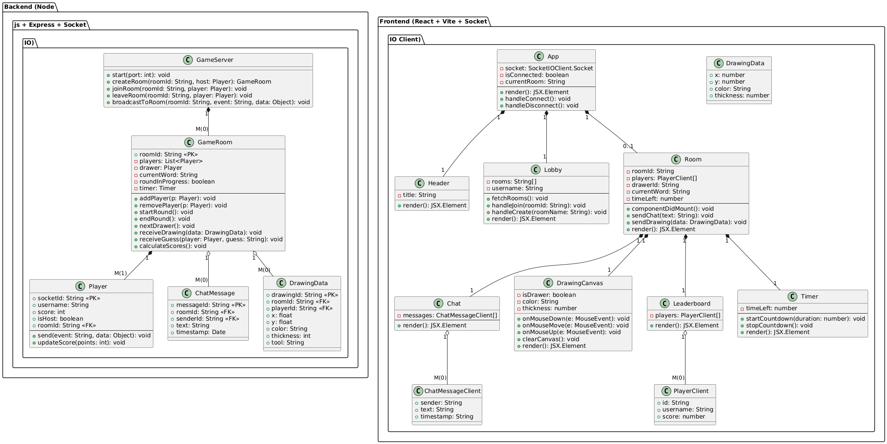
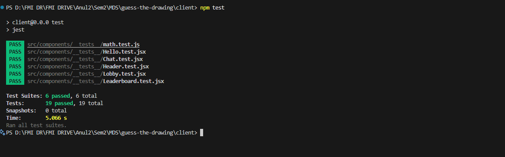
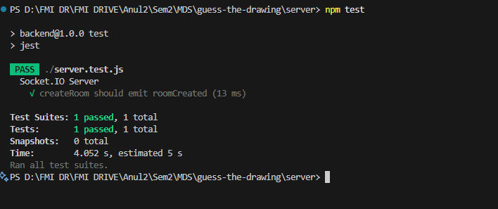

# Guess the Drawing

A real-time multiplayer drawing game where one player draws a hidden word while the others try to guess it through chat before time runs out.
> [Play the game](https://guess-the-drawing-tau.vercel.app/)
> [Video demo]([https://guess-the-drawing-tau.vercel.app/](https://youtu.be/7kIcNPx2oTA))

## 🛠️ Technologies Used

### Frontend (`client/`)

- React 19
- Vite
- Socket.IO Client
- React-Konva (drawing canvas)

### Backend (`server/`)

- Node.js
- Express
- Socket.IO

---

## 🚀 Features

- Create or join a game room
- Automatic drawer selection at the start of each round
- Real-time synchronized drawing canvas
- Guessing via live chat
- Dynamic scoring system and leaderboard
- Only the room creator can start the game
- Kick players from the room
- WhatsApp invitation with auto-generated room link

---

## 🧪 Automated Testing

- Unit tests for key components: `Chat`, `Header`, `Leaderboard`, `Lobby`
- Configured using **Jest** and **React Testing Library**

```bash
# from the client/ folder
npm install
npm test
```

## ⚙️ How to Run Locally

1. Clone the repository:
   ```bash
   git clone https://github.com/madalinioana/guess-the-drawing
   cd guess-the-drawing
   ```
2. Install dependencies:
   
   Backend:
   ```bash
   cd server
   npm install
   ```
   Frontend:
   ```bash
   cd ../client
   npm install
   ```
4. Run the app:
   
   Server:
   ```bash 
   node server.js
   ```
   Client:
   ```bash
   npm run dev
   ```
5. Open your browser at http://localhost:5173 

## UML Diagram



Below is a concise, plain-language overview of the UML diagram shown above:

1. **Overall Layout**  
   - The diagram is split into two halves: **Backend (left)** and **Frontend (right)**.  
   - Both halves live inside a single bounding box labeled with their technology stacks (Node/Express/Socket.io on the left; React/Vite/Socket.io Client on the right).

2. **Backend Section**  
   - **GameServer** sits at the top: it listens on a network port, handles incoming Socket.io connections, and exposes methods such as `start(port)`, `createRoom(roomId, host)`, `joinRoom(roomId, player)`, `leaveRoom(roomId, player)`, and `broadcastToRoom(roomId, event, data)`.  
   - **GameRoom** is the core “room” object:  
     - **Attributes:**  
       - `roomId` (unique primary key)  
       - `players: List<Player>` (all participants)  
       - `drawer: Player` (the player currently drawing)  
       - `currentWord: String` (word to be drawn)  
       - `roundInProgress: boolean` (tracks if a round is active)  
       - `timer: Timer` (manages the countdown)  
     - **Methods:**  
       - `addPlayer(p: Player)` / `removePlayer(p: Player)`  
       - `startRound()` / `endRound()` / `nextDrawer()`  
       - `receiveDrawing(data: DrawingData)` (processes pencil strokes)  
       - `receiveGuess(player: Player, guess: String)` (checks chat guesses)  
       - `calculateScores()`  
     - Represents a single game room: it holds state for players, the current drawer, the current word, and round timing.  
   - **Player** represents one connected user:  
     - **Attributes:**  
       - `socketId: String` (primary key)  
       - `username: String`  
       - `score: int`  
       - `isHost: boolean` (true if this player created the room)  
       - `roomId: String` (foreign key to GameRoom)  
     - **Methods:**  
       - `send(event: String, data: Object)` (emit a socket event)  
       - `updateScore(points: int)` (adjust the player’s score)  
   - **ChatMessage** models each text message sent in a room:  
     - **Attributes:**  
       - `messageId: String` (primary key)  
       - `roomId: String` (foreign key)  
       - `senderId: String` (foreign key to Player)  
       - `text: String`  
       - `timestamp: Date`  
     - Represents a single chat entry.  
   - **DrawingData** encapsulates every drawing stroke:  
     - **Attributes:**  
       - `drawingId: String` (primary key)  
       - `roomId: String` (foreign key)  
       - `playerId: String` (foreign key to Player)  
       - `x: float` / `y: float` (coordinates)  
       - `color: String`  
       - `thickness: int`  
       - `tool: String` (e.g., “brush” or “eraser”)  
     - When the drawer moves their mouse, the client builds a DrawingData object and sends it to the server, which relays it to all other clients in that room.

3. **Frontend Section**  
   - **App** is the root React component:  
     - **Attributes:**  
       - `socket: SocketIOClient.Socket` (the active socket connection)  
       - `isConnected: boolean` (tracks connection status)  
       - `currentRoom: String` (the room code the user has joined)  
     - **Methods:**  
       - `render(): JSX.Element`  
       - `handleConnect(): void` / `handleDisconnect(): void`  
     - Initializes the Socket.io client and tracks global connection state.  
   - **Header** is a simple component displaying the game’s title.  
   - **Lobby** allows users to browse or create rooms:  
     - **Attributes:**  
       - `rooms: String[]` (list of active room codes)  
       - `username: String` (entered by the player)  
     - **Methods:**  
       - `fetchRooms(): void` (retrieve available rooms)  
       - `handleJoin(roomId: String): void` (join an existing room)  
       - `handleCreate(roomName: String): void` (create a new room)  
       - `render(): JSX.Element`  
   - **Room** represents the main game view after joining:  
     - **Attributes:**  
       - `roomId: String`  
       - `players: PlayerClient[]` (client-side player models)  
       - `drawerId: String` (which player is currently drawing)  
       - `currentWord: String` (hidden from guessers)  
       - `timeLeft: number` (remaining seconds in the current round)  
     - **Methods:**  
       - `componentDidMount(): void` (register socket listeners)  
       - `sendChat(text: String): void` (emit a chat/guess event)  
       - `sendDrawing(data: DrawingData): void` (emit stroke data)  
       - `render(): JSX.Element`  
     - Displays chat, drawing canvas, player list (leaderboard), and timer.  
   - **Chat** displays a scrolling list of `ChatMessageClient[]` objects, each with `sender`, `text`, and `timestamp`.  
   - **DrawingCanvas** is the interactive drawing area:  
     - **Attributes:**  
       - `isDrawer: boolean` (true if this client is the current drawer)  
       - `color: String` / `thickness: number` (brush settings)  
     - **Methods:**  
       - `onMouseDown(e: MouseEvent): void` / `onMouseMove(e: MouseEvent): void` / `onMouseUp(e: MouseEvent): void` (gather and emit DrawingData)  
       - `clearCanvas(): void` (reset the canvas at round start/end)  
       - `render(): JSX.Element`  
   - **Leaderboard** shows a list of `PlayerClient[]`, each with `id`, `username`, and `score`, highlighting the drawer.  
   - **Timer** displays the countdown (`timeLeft: number`) and has methods `startCountdown(duration: number)` and `stopCountdown()`.  
   - **PlayerClient** (client-side model):  
     - `id: String`  
     - `username: String`  
     - `score: number`  
   - **ChatMessageClient** (client-side model):  
     - `sender: String`  
     - `text: String`  
     - `timestamp: String`

4. **Key Relationships & Data Flow**  
   1. **Server → Room Management**  
      - Clients emit `createRoom` or `joinRoom` to **GameServer**, which creates/returns a **GameRoom**.  
      - **GameRoom** holds its `players`, the current `drawer`, and a **Timer**.  
      - When a round starts, **GameRoom** selects a `currentWord`, sets `roundInProgress = true`, and starts the **Timer**.

   2. **Drawing Broadcast**  
      - The drawer’s client calls `onMouseMove` in **DrawingCanvas**, emitting `drawing` events matching **DrawingData** to **GameServer**.  
      - **GameServer** calls `broadcastToRoom(roomId, 'drawing', data)`. Each client’s **DrawingCanvas** receives that data and renders the stroke immediately.

   3. **Chat & Guess Processing**  
      - All clients send chat messages via `sendChat(text)` in **Room**, emitting a `guessAttempt` event to **GameServer**.  
      - **GameServer** runs `receiveGuess(player, guess)`. If correct, it updates that **Player**’s score and broadcasts a “correct guess” event.  
      - The **Leaderboard** updates by broadcasting an updated `players` list to all clients.

   4. **Round Transition**  
      - When the **Timer** in **GameRoom** expires or everyone guesses correctly, **GameRoom** calls `endRound()`, updates scores, picks a new drawer with `nextDrawer()`, chooses a new `currentWord`, and resets the **Timer**.  
      - Clients receive a `newRound` event, which triggers **DrawingCanvas.clearCanvas()**, **Timer.startCountdown()**, and updates the drawer highlight in **Leaderboard**.

   5. **Client State Models**  
      - **PlayerClient** and **ChatMessageClient** mirror server-side **Player** and **ChatMessage** but use client-friendly types (e.g., timestamp as a string).  
      - **DrawingData** on the client matches exactly what the server expects for real-time stroke broadcasting.


## Unit Test Automation

**Status:** In progress  

Tests are written using [Jasmine](https://jasmine.github.io/) (frontend) and [Mocha & Chai](https://mochajs.org/ + https://www.chaijs.com/) (backend).

- **Backend Tests (Mocha & Chai):**  
  - `RoomService`  
    - `createRoom()`  
    - `joinRoom()`  
    - `assignWord()`  
  - `ScoreService`  
    - `calculatePoints()`  
    - `updateLeaderboard()`  
  - `WordBank`  
    - `getRandomWord()`  
    - `validateCustomWordList()`  

- **Frontend Tests (Jasmine):**  
  - `DrawingComponent`  
    - should emit stroke data on draw  
    - should clear canvas at round end  
  - `ChatComponent`  
    - should send chat message on Enter  
    - should not allow empty guesses  
  - `LobbyComponent`  
    - should create a new room via API  
    - should navigate to room on successful join  

_Test results snapshot:_  



### How to Run Tests

#### Backend
```bash
cd server
npm install
npm test
```
### Client
```bash
cd client
npm install
npm test
```

## 9. Design Patterns

### [Socket.io Pub/Sub Pattern](https://socket.io/docs/v4/pub-sub/)  

#### Directory Structure
```plaintext
Backend/
├─ controllers/
│  ├─ roomController.js
│  ├─ gameController.js
│  └─ chatController.js
├─ services/
│  ├─ RoomService.js
│  ├─ GameService.js
│  └─ ScoreService.js
├─ models/
│  ├─ Room.js
│  ├─ Player.js
│  └─ GameRound.js
├─ utils/
│  └─ WordBank.js
├─ sockets/
│  └─ socketHandlers.js
├─ routes.js
└─ server.js

Frontend/
├─ src/
│  ├─ app/
│  │  ├─ drawing/
│  │  ├─ chat/
│  │  ├─ lobby/
│  │  ├─ leaderboard/
│  │  └─ services/
│  │     ├─ socket.service.ts
│  │     └─ api.service.ts
│  ├─ assets/
│  └─ index.html
└─ angular.json
```

## 🤖 AI-assisted Development (Prompt Engineering)

During the development of this project, we used AI (ChatGPT) to assist with architecture decisions, game mechanics, and code implementation. Below is a summary of how prompt-based guidance improved our workflow and helped shape the game logic.

---

### ✅ Topics and Prompt Outcomes

#### 1. Game Architecture Design
**Prompt:** How to build a browser-based multiplayer drawing and guessing game like Skribbl.io  
**Outcome:**  
We received a scalable full-stack architecture suggestion using:
- **Frontend**: HTML/CSS/JS + Canvas API
- **Backend**: Node.js + Express
- **Real-time layer**: Socket.IO for WebSocket communication
- Modular design with clear role separation and support for multiple game rooms.

---

#### 2. Turn-Based Game Logic
**Prompt:** How to rotate turns and automatically switch to the next player after a timer or correct guess  
**Outcome:**  
Implemented a `currentTurnIndex`, with round tracking and `setTimeout` for turn duration. Turn ends early if someone guesses the word correctly. Logic includes disconnect handling and smooth player transitions.

---

#### 3. Real-Time Drawing Synchronization
**Prompt:** How to broadcast Canvas drawing events via Socket.IO  
**Outcome:**  
Implemented real-time drawing by emitting `mousemove` events and broadcasting them to other players. Suggestions included throttling mouse events, sending batched points, and drawing optimization for smoother rendering.

---

#### 4. Edge Case Handling
**Prompt:** What edge cases should be tested in a real-time multiplayer drawing game  
**Outcome:**  
Got a comprehensive list of failure scenarios like:
- Drawer disconnects mid-turn
- Players joining mid-game
- Multiple correct guesses
- Abusing guessing system
Provided actionable strategies for each.

---

#### 5. WebSocket Deployment
**Prompt:** How to deploy a Node.js + Socket.IO game on Vercel  
**Outcome:**  
Learned that Vercel doesn't support persistent WebSockets. Deployed backend separately to **Render** or **Fly.io**, and connected frontend from Vercel using CORS.

---

#### 6. UI/UX Suggestions
**Prompt:** Fun UI/UX ideas for a drawing-guessing game  
**Outcome:**  
Got ideas like:
- Brush customization
- Canvas glow on correct guess
- Animated guess feedback
- Circular timer for drawer
- Emoji reactions and score bubbles

---

### ✅ Summary

By leveraging prompt engineering, we accelerated the development of core features, avoided common pitfalls, and built a more polished multiplayer game. Using ChatGPT helped us validate design decisions and focus on user experience without reinventing the wheel.

> 📄 Full prompt-response history available at: [ChatGPT conversation link](https://chatgpt.com/share/684f0a50-3e9c-8007-b4a5-e20547ab7b5d)


