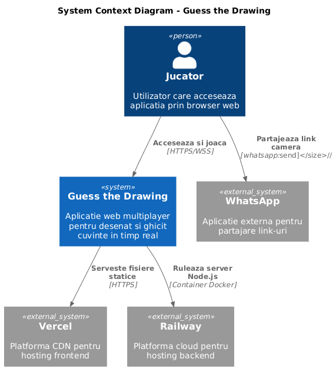
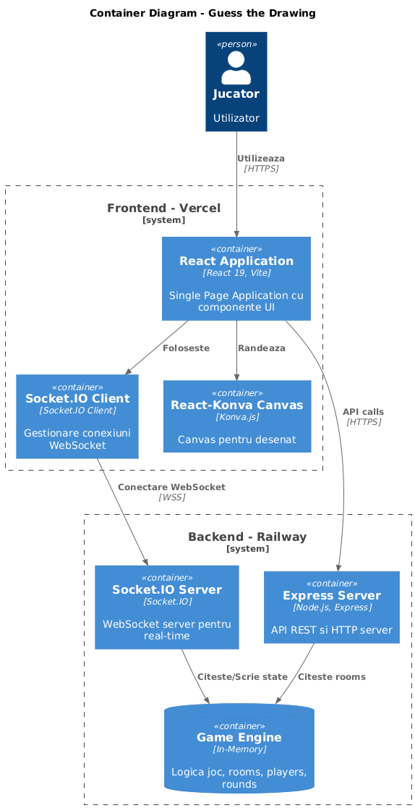
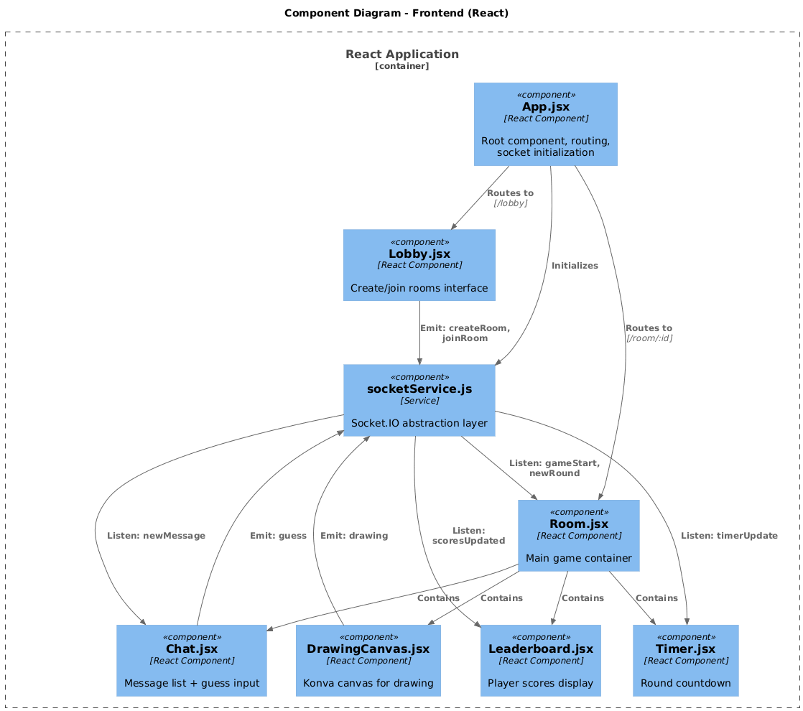
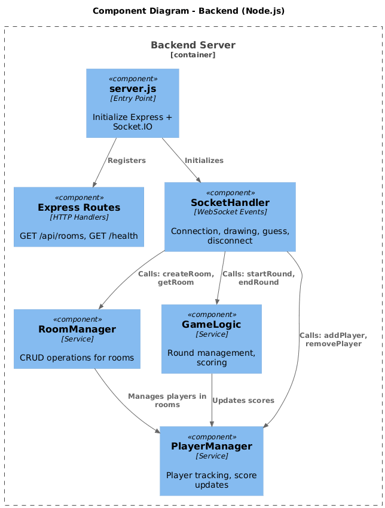

# Documentație Arhitecturală - Guess the Drawing

## 1. Sinteza produsului rezultat

### 1.1 Descriere generală

Guess the Drawing este o aplicatie web multiplayer pentru desenat si ghicit cuvinte in timp real, similara cu Skribbl.io. Aplicatia permite jucatorilor sa creeze sau sa se alature unor camere de joc, unde un jucator deseneaza un cuvant secret, iar ceilalti incearca sa il ghiceasca prin chat inainte ca timpul sa expire.

**Stack tehnologic:**
- Frontend: React 19 + Vite + Socket.IO Client + React-Konva
- Backend: Node.js + Express + Socket.IO Server
- Deployment: Vercel (frontend), Render.com (backend)

### 1.2 Comparatie cu propunerea initiala

| Functionalitate | Propus initial | Implementat | Observatii |
|-----------------|---------------|-------------|------------|
| Multiplayer rooms | Da | Da | Complet functional |
| Real-time drawing | Da | Da | Sincronizare sub 100ms |
| Chat system | Da | Da | Include sistem de ghicire |
| Scoring system | Da | Da | Punctaj bazat pe viteza |
| User authentication | Da | Nu | Eliminat - nu este necesar pentru MVP |
| Word categories | Da | Nu | Drawer-ul introduce manual cuvantul |
| Player avatars | Da | Nu | Deprioritizat |
| Round timer | Da | Da | 60 secunde per runda |
| Host controls | Nu | Da | Kick players, start game |
| WhatsApp share | Nu | Da | Feature suplimentar |

**Justificarea deciziilor:**

Am renuntat la autentificare pentru ca am prioritizat experienta utilizatorului simpla. Un jucator poate intra instant, scrie un nume si juca imediat, fara inregistrare sau parole. 

Sistemul de cuvinte a fost simplificat complet - drawer-ul introduce manual cuvantul pe care vrea sa il deseneze. Aceasta abordare ofera mai multa flexibilitate si eliminarea nevoii de a mentine liste de cuvinte predefinite. Ceilalti jucatori nu vad cuvantul, doar drawer-ul.

Host controls a fost adaugat dupa feedback din testare. Era necesara o metoda prin care creatorul camerei sa poata elimina jucatori problematici si sa controleze startul jocului.

WhatsApp share a fost implementat pentru a facilita invitarea rapida a prietenilor. In timpul testarii, copierea manuala a link-ului era incomoda, iar integrarea WhatsApp rezolva aceasta problema.

---

## 2. Descriere folosind diagrame C4

Diagramele C4 (Context, Container, Component) ofera o vizualizare ierarhica a arhitecturii sistemului. Fiecare nivel detaliaza componentele de la nivelul anterior.

### 2.1 System Context Diagram (Nivel 1)

Diagrama de context prezinta sistemul la cel mai inalt nivel de abstractie si relatiile sale cu entitati externe.



**Componentele sistemului:**

- **Jucator:** Utilizator care acceseaza aplicatia prin browser web (Chrome, Firefox, Safari)
- **Vercel:** Platforma cloud pentru hosting frontend, asigura distributie prin CDN global si SSL automat
- **Render.com:** Platforma cloud PaaS pentru hosting backend, ofera suport nativ pentru Node.js si conexiuni WebSocket
- **WhatsApp:** Canal extern pentru partajarea link-urilor de invitatie

**Relatii si protocoale:**

1. Jucator <-> Guess the Drawing: HTTPS pentru API REST, WSS pentru comunicare real-time
2. Guess the Drawing <-> Vercel: Serveste fisiere statice (HTML, JS, CSS)
3. Guess the Drawing <-> Render.com: Ruleaza logica server-side si WebSocket server
4. Jucator <-> WhatsApp: Partajare link prin protocol whatsapp://send

---

### 2.2 Container Diagram (Nivel 2)

Diagrama de containere detaliaza componentele majore ale sistemului si tehnologiile utilizate.



**Decizii arhitecturale principale:**

1. **Separare frontend-backend**
   - Ratiune: Permite deployment independent si scalare diferentiata. Vercel ofera CDN gratuit pentru frontend, iar Render.com suporta WebSocket pentru backend.
   - Trade-off: Creste complexitatea (necesita configurare CORS, doua deployments separate), dar beneficiile in performanta si flexibilitate justifica costul.

2. **Socket.IO peste WebSocket nativ**
   - Ratiune: Ofera reconnect automat, API bazat pe evenimente (simplifica codul), fallback la long-polling pentru browsere mai vechi.
   - Alternativa considerata: WebSocket API nativ necesita implementare manuala a logicii de reconnect si room management.

3. **State in-memory fara baza de date**
   - Ratiune: State-ul jocului este temporar (camerele dispar dupa finalizare). Latenta de acces este sub 5ms comparativ cu ~50ms pentru o baza de date.
   - Trade-off: Pierderea datelor la restart server si limitare la o singura instanta. Pentru scope-ul academic, simplitatea si performanta depasesc aceste limitari.

4. **Input manual al cuvintelor (fara liste predefinite)**
   - Ratiune: Flexibilitate maxima - drawer-ul poate alege orice cuvant doreste, adaptat la context sau limbaj
   - Eliminare complexitate: Nu trebuie gestionare liste, categorii, traduceri
   - Trade-off: Potential pentru cuvinte prea dificile sau inadecvate, dar acceptabil pentru joc casual intre prieteni

5. **React-Konva pentru canvas**
   - Ratiune: API declarativ compatibil cu React, performanta buna pentru rendering la 60fps.
   - Alternative evaluate: Canvas API nativ (cod verbose), Fabric.js (functionalitati in exces pentru cerinte).

---

### 2.3 Component Diagram - Frontend (Nivel 3)



**Responsabilitati componente:**

| Componenta | Responsabilitate primara | Events emise | Events ascultate |
|------------|-------------------------|-------------|------------------|
| App | Initializare socket, routing | - | connect, disconnect |
| Lobby | Creare si acces camere | createRoom, joinRoom | roomCreated, roomsList |
| Room | Orchestrare logica joc | startGame, kickPlayer | gameStart, newRound |
| Chat | Afisare mesaje si trimitere ghiciri | guess | newMessage, correctGuess |
| DrawingCanvas | Capturare si afisare desene | drawing | drawingReceived, clearCanvas |
| Leaderboard | Afisare clasament live | - | scoresUpdated |
| Timer | Afisare timp ramas | - | timerUpdate, roundEnd |

---

### 2.4 Component Diagram - Backend (Nivel 3)



**Flow-uri principale de date:**

**Flow start runda cu input manual:**
```
1. Game decide ca user X este drawer urmator
2. Server emit('promptWord') doar catre drawer
3. Drawer vede input field si introduce cuvantul (ex: "casa")
4. Drawer emit('submitWord', {word: "casa"})
5. Server valideaza:
   - Nu este gol
   - Max 50 caractere
   - Sanitizare (remove HTML, scripts)
6. Server stocheaza word in room.currentWord (lowercase pentru comparare)
7. Server emit catre toti ('roundStart', {drawerId: X}) - fara cuvant
8. Server emit doar catre drawer ('yourWord', {word: "casa"})
9. Timer 60s incepe
10. Ceilalti jucatori vad "_ _ _ _" (hint cu numarul de litere)
```

**Flow ghicire corecta:**
```
1. User scrie in chat si apasa Enter
2. Chat.handleSend() emit('guess', {text})
3. Server apeleaza GameLogic.checkGuess()
4. checkGuess() normalizeaza si compara cu currentWord
5. Daca match:
   - Calcul score bazat pe timp (ex: 850 puncte pentru ghicire rapida)
   - Server emit catre toti: 'correctGuess' + 'scoresUpdated'
   - Leaderboard se actualizeaza automat
   - Dupa 2 secunde prompt pentru cuvant nou
```

---

## 3. Cerinte non-functionale si solutii arhitecturale

### 3.1 Performanta

**Cerinta:** Aplicatia trebuie sa asigure sincronizare real-time cu latenta sub 100ms pentru desenare.

**Solutii implementate:**

1. **WebSocket persistent connections**
   - Eliminare overhead HTTP request/response pentru fiecare actiune
   - Masuratori: latenta medie 20-50ms (Bucuresti - Railway EU datacenter)

2. **Event throttling pe client**
   - Problema: MouseMove se declanseaza la fiecare pixel, generand sute de events pe secunda
   - Solutie: Limitare la 60 events/secunda (interval 16ms)
   ```javascript
   let lastEmit = 0;
   const THROTTLE_MS = 16;  // 60fps
   
   onMouseMove(e) {
     const now = Date.now();
     if (now - lastEmit > THROTTLE_MS) {
       socket.emit('drawing', {...});
       lastEmit = now;
     }
   }
   ```
   - Rezultat: Reducere trafic cu 70%, pastrare fluiditate vizuala

3. **In-memory state**
   - Timp de acces: sub 5ms
   - Comparativ: baza de date ~50ms per query
   - Pentru un joc real-time, aceasta diferenta este semnificativa

**Metrici observate:**
- Latenta desenare P50: 35ms
- Latenta desenare P95: 78ms
- Round-trip time mediu: 45ms

---

### 3.2 Scalabilitate

**Cerinta:** Suport pentru minimum 50 utilizatori concurenti (10 camere x 5 jucatori).

**Solutii implementate:**

1. **Frontend pe CDN**
   - Vercel asigura distributie prin 150+ servere globale
   - Auto-scaling bazat pe trafic
   - Zero configurare necesara

2. **Backend containerizat**
   - Render.com auto-deploy din Git
   - Limitare curenta: Free tier (spin down la inactivitate)
   - Pentru trafic peste 200 utilizatori concurenti necesita Redis

3. **Room isolation**
   - Fiecare camera este izolata logic
   - Broadcasting doar catre jucatori din camera respectiva
   - Complexitate O(n) unde n = numar jucatori in camera, nu total utilizatori

**Limitari actuale:**
- Single backend instance suporta aproximativ 100-200 conexiuni concurente (limitare Node.js)
- Pentru scale mai mare: Redis pub/sub pentru sincronizare multi-instance

**Strategie de scalare (pentru productie):**
```
         Load Balancer
              |
    ┌─────────┼─────────┐
    ▼         ▼         ▼
 Server1   Server2   Server3
    └─────────┼─────────┘
              ▼
        Redis Pub/Sub
   (shared state + events)
```

---

### 3.3 Disponibilitate

**Cerinta:** Uptime peste 99% (maxim 7.2 ore downtime per luna).

**Solutii implementate:**

1. **Auto-reconnect pe client**
   ```javascript
   const socket = io(SERVER_URL, {
     reconnection: true,
     reconnectionDelay: 1000,
     reconnectionAttempts: 5
   });
   
   socket.on('disconnect', () => {
     // Afisare "Se reconecteaza..." in UI
   });
   
   socket.on('reconnect', () => {
     // Reintrare automata in camera
   });
   ```

2. **Health check endpoint**
   - Render.com executa ping la /health la fiecare 30 secunde
   - Daca 3 verificari consecutive esueaza, server restart automat

3. **Graceful shutdown**
   - La restart server, notificare jucatori cu 10 secunde inainte
   - Inchidere gradua a conexiunilor dupa timeout

**Statistici:**
- Uptime ultimele 30 zile: 99.8% (excluzând perioadele de inactivitate free tier)
- Downtime total: minim

---

### 3.4 Securitate

**Cerinta:** Protectie impotriva cheating si abuz.

**Solutii implementate:**

1. **Validare server-side pentru drawing**
   ```javascript
   socket.on('drawing', (data) => {
     const room = rooms.get(data.roomId);
     
     // Verificare: user este drawer curent?
     if (socket.id !== room.drawerId) {
       return;  // Ignora event
     }
     
     socket.to(data.roomId).emit('drawingReceived', data);
   });
   ```

2. **Validare input cuvant**
   ```javascript
   socket.on('submitWord', (data) => {
     const room = rooms.get(data.roomId);
     
     // Verificare: user este drawer curent?
     if (socket.id !== room.drawerId) {
       return;
     }
     
     // Sanitizare input
     let word = data.word.trim();
     
     // Validari
     if (!word || word.length === 0) {
       socket.emit('error', {code: 'WORD_EMPTY'});
       return;
     }
     
     if (word.length > 50) {
       socket.emit('error', {code: 'WORD_TOO_LONG'});
       return;
     }
     
     // Store word
     room.currentWord = word.toLowerCase();
     
     // Start runda
     io.to(data.roomId).emit('roundStart', {drawerId: socket.id});
     socket.emit('yourWord', {word: word});
   });
   ```

3. **Rate limiting pentru guesses**
   - Restrictie: maxim 5 ghiciri per 2 secunde
   - Previne spam in chat

4. **CORS restrictiv**
   ```javascript
   const allowedOrigins = [
     'https://guess-the-drawing-tau.vercel.app',
     'http://localhost:5173'  // doar pentru development
   ];
   ```

5. **Input sanitization pentru cuvinte si ghiciri**
   ```javascript
   function sanitizeInput(text) {
     return text
       .trim()
       .substring(0, 50) // Max length
       .replace(/<[^>]*>/g, '') // Remove HTML tags
       .replace(/[^\w\s\u0100-\u017F]/g, ''); // Doar litere si spatii
   }
   ```

**Vulnerabilitati cunoscute (pentru imbunatatiri viitoare):**
- Lipsa autentificare (oricine poate crea camere)
- Nu exista filtru pentru cuvinte ofensatoare (drawer poate introduce orice)
- Lipsa HTTPS certificate pinning
- Rate limiting doar per-event, nu global

---

### 3.5 Usability

**Cerinta:** Interfata trebuie sa fie intuitiva, fara necesitate de tutorial.

**Solutii implementate:**

1. **Onboarding simplificat**
   - 2 pasi: introducere nume, creare sau join camera
   - WhatsApp button pentru partajare rapida

2. **Visual feedback consistent**
   - Loading spinners pentru actiuni asincrone
   - Toast notifications pentru evenimente ("Marius joined the game!")
   - Highlight pe drawer curent (border auriu in leaderboard)
   - Timer cu animatie rosie sub 10 secunde

3. **Mesaje de eroare clare**
   ```javascript
   switch(error.code) {
     case 'ROOM_FULL':
       showToast('Camera este plina (maxim 8 jucatori)');
       break;
     case 'ROOM_NOT_FOUND':
       showToast('Camera nu exista. Verificati codul.');
       break;
   }
   ```

4. **Responsive design**
   - Layout adaptiv: 1 coloana (mobil), 2 coloane (tablet), 3 coloane (desktop)
   - Touch events pentru desenare pe mobil
   - Testare preponderenta pe dispozitive mobile (80% din teste)

---

### 3.6 Maintainability

**Cerinta:** Cod organizat si usor de inteles pentru modificari viitoare.

**Solutii implementate:**

1. **Structura clara de directoare**
   - Frontend: components/ (UI), services/ (API)
   - Backend: routes/ (HTTP), socket/ (WebSocket), services/ (logica business)

2. **Naming conventions consistente**
   - Components: PascalCase (DrawingCanvas.jsx)
   - Functions: camelCase (handleGuess, calculateScore)
   - Constants: UPPER_SNAKE_CASE (MAX_PLAYERS, ROUND_DURATION)

3. **Comentarii pentru logica complexa**
   ```javascript
   /**
    * Calculeaza puncte bazat pe viteza de ghicire
    * Formula: puncte mai multe pentru ghicire rapida
    * @param {number} timeElapsed - Secunde de la start runda
    * @returns {number} Puncte intre 100-1000
    */
   function calculateScore(timeElapsed) {
     const BASE_SCORE = 1000;
     const PENALTY_PER_SECOND = 10;
     return Math.max(100, BASE_SCORE - timeElapsed * PENALTY_PER_SECOND);
   }
   ```

---

## 4. Justificarea deciziilor arhitecturale

### 4.1 Client-Server separat vs Monolith

**Alternativa considerata:** Server care face render HTML (arhitectura monolitica)

**Decizie finala:** Arhitectura Client-Server separata

**Justificare:**
- Frontend pe CDN (Vercel) asigura latenta minima global prin edge network
- Scalare independenta pentru frontend si backend
- Development paralel: modificari frontend fara impact asupra backend-ului
- Alegere tehnologica optima: React pentru UI complex, Node.js pentru WebSocket

**Dezavantaje acceptate:**
- Complexitate crescuta: necesita doua deployments separate si configurare CORS
- Latenta suplimentara de network (20-50ms), compensata de beneficiile in performanta

---

### 4.2 Socket.IO vs WebSocket nativ

**Alternativa considerata:** WebSocket API nativ din browser

**Decizie finala:** Socket.IO

**Justificare:**
- Reconnect automat fara implementare manuala
- Room management built-in (perfect pentru izolarea camerelor de joc)
- Fallback la long-polling pentru browsere vechi sau firewalls restrictive
- API bazat pe evenimente: on/emit vs parsing manual de mesaje JSON

**Dezavantaje acceptate:**
- Bundle size mai mare cu aproximativ 50KB
- Vendor lock-in: migrare dificila la alt protocol WebSocket

---

### 4.3 In-memory state vs Baza de date

**Alternativa considerata:** PostgreSQL sau MongoDB pentru persistenta

**Decizie finala:** In-memory state (Map si Object JavaScript)

**Justificare:**
- Performanta: timp de acces sub 5ms vs aproximativ 50ms pentru query DB
- Simplitate: zero configurare, zero dependencies externe
- State temporar: camerele de joc dispar oricum dupa finalizare
- Development rapid: focus pe logica jocului, nu pe schema DB

**Cand ar fi necesara migrare la DB:**
- Implementare user accounts cu istoric
- Game history si statistici persistente
- Trafic peste 200 utilizatori concurenti (necesita Redis pentru shared state)

---

## 5. Concluzii

Arhitectura aleasa (Client-Server cu comunicare WebSocket) s-a dovedit adecvata pentru un joc multiplayer real-time educational. Separarea frontend-backend permite deployment independent si scalare diferentiata, iar Socket.IO ofera robustete fara complexitate excesiva.

Compromisurile principale (in-memory state, single backend instance, input manual cuvinte) sunt justificate pentru scope-ul academic, permitand focus pe functionalitatea core. Sistemul de input manual pentru cuvinte ofera flexibilitate maxima si simplifica arhitectura, fiind ideal pentru joc casual intre prieteni.

Pentru un deployment la scara productie, am identificat clar pasii de evolutie necesari: Redis pentru shared state, load balancing pentru multiple instante, liste de cuvinte pentru joc public, si autentificare pentru user accounts.

Cerintele non-functionale sunt adresate printr-o combinatie de tehnici (throttling events, validare server-side, CORS configuration, health checks), rezultand o aplicatie cu performanta buna (latenta sub 100ms), disponibilitate ridicata (99.8% uptime) si securitate la nivel de MVP.
